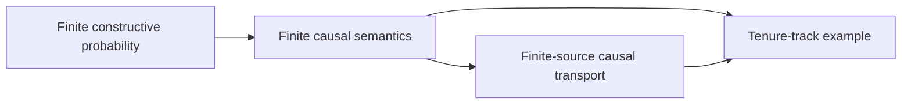

# Mathematical inference: science and logic

This repository accompanies Jelmer de Boer's 2026 Master’s thesis in
Artificial Intelligence, *Mathematical inference: science and logic*.

The thesis develops a finite, constructive account of mathematical inference.
It brings together Jaynes-style probability, Pearl-style structural causal
models, and explicit changes in epistemic state, with selected constructions
and proofs checked in Lean 4. It also considers the scientific practices and
institutions in which inference is performed.

## Read the thesis

The complete thesis is available as a [PDF](latex/main.pdf).

## Lean formalisation

The Lean development formalises selected finite constructions from the thesis.
Its public entry points are:

- `Thesis.Probability` — finite constructive probability;
- `Thesis.Causality` — finite structural causal models, interventions, modal
  edits, and counterfactual semantics; and
- `Thesis.CausalTransport` — finite-source correspondence and explicit
  interfaces to externally established causal results.

The complete development also includes a tenure-track example that combines
these components.



### Verification

The project uses Lean `v4.30.0-rc2` and has no third-party Lake dependencies.
To build the development:

```sh
cd lean
lake build
```

For an optional audit of the representative theorem surface, run:

```sh
cd lean
lake env lean Thesis/AxiomAudit.lean
```

The audit reports the axioms used by selected probability, causal, transport,
modal, and example declarations. Its accepted boundary is `propext` and
`Quot.sound` (or no axioms); results such as completeness, global Markov, and
d-separation equivalence remain explicit parameters at the transport
interfaces rather than Lean axioms.

Continuous probability, general measure theory, and a complete formalisation
of every philosophical or sociological claim are outside this project's scope.
