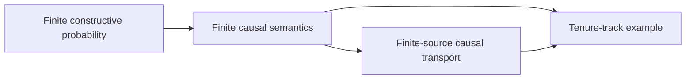

# Mathematical inference: science and logic

This repository holds Jelmer de Boer's *Mathematical inference: science and
logic*: the Master's thesis in Artificial Intelligence submitted to the Open
University in 2026, and a book manuscript based on that thesis.

The work develops a finite, constructive account of mathematical inference.
It brings together Jaynes-style probability, Pearl-style structural causal
models, and explicit changes in epistemic state, with selected constructions
and proofs checked in Lean 4. It also considers the scientific practices and
institutions in which inference is performed.

## Read the texts

- The submitted thesis is available as a [PDF](latex/Thesis_Jelmer_de_Boer.pdf).
- The book manuscript is available as a [PDF](latex/mathematical_inference.pdf).

## Lean formalisation

The Lean development formalises selected finite constructions from the work.
Its public entry points are:

- `Thesis.Probability` — finite constructive probability;
- `Thesis.Causality` — finite structural causal models, interventions, modal
  edits, and counterfactual semantics; and
- `Thesis.CausalTransport` — finite-source correspondence and explicit
  interfaces to externally established causal results.

The complete development also includes a tenure-track example that combines
these components.



### Verification

The project uses Lean `v4.30.0-rc2` and has no third-party Lake dependencies.
To build the development:

```sh
cd lean
lake build
```

To enforce the project-wide kernel-axiom policy, run:

```sh
cd lean
lake build Thesis.AxiomAudit
```

The audit checks every declaration owned by an imported `Thesis.*` library
module and fails the build if a transitive kernel dependency is not `propext`
or `Quot.sound`. Continuous integration builds this audit target explicitly.
Results such as completeness, global Markov, and d-separation equivalence
remain explicit parameters at the transport interfaces rather than Lean
axioms.

Continuous probability, general measure theory, and a complete formalisation
of every philosophical or sociological claim are outside this project's scope.
