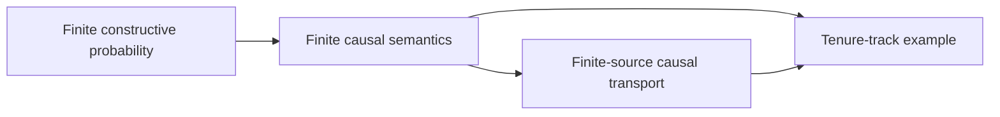

# Mathematical inference: science and logic

This repository holds Jelmer de Boer's *Mathematical inference: science and
logic*: the Master's thesis in Artificial Intelligence submitted to the Open
University in 2026, and a book manuscript based on that thesis.

The work develops a finite, constructive account of mathematical inference.
It brings together Jaynes-style probability, Pearl-style structural causal
models, and explicit changes in epistemic state, with selected constructions
and proofs checked in Lean 4. It also considers the scientific practices and
institutions in which inference is performed.

## Read the texts

- The submitted thesis is available as a [PDF](latex/Thesis_Jelmer_de_Boer.pdf).
- The book manuscript is available as a [PDF](latex/mathematical_inference.pdf).

## Lean formalisation

The Lean development formalises selected finite constructions from the work.
Its public entry points are:

- `Thesis.Probability` — finite constructive probability;
- `Thesis.Causality` — finite structural causal models, interventions, modal
  edits, and counterfactual semantics; and
- `Thesis.CausalTransport` — finite-source correspondence and explicit
  interfaces to externally established causal results.

The complete development also includes a tenure-track example that combines
these components.


```mermaid
flowchart LR
  P[Finite constructive probability] --> C[Finite causal semantics]
  C --> T[Finite-source causal transport]
  C --> E[Tenure-track example]
  T --> E
```

### Verification

The project uses Lean `v4.30.0-rc2` and has no third-party Lake dependencies.
To build the development:

```sh
cd lean
lake build
```

To enforce the project-wide kernel-axiom policy, run:

```sh
cd lean
lake build Thesis.AxiomAudit
```

The audit checks every declaration owned by an imported `Thesis.*` library
module and fails the build if a transitive kernel dependency is not `propext`
or `Quot.sound`. Continuous integration builds this audit target explicitly.
Finite-model soundness, d-separation correctness, and positive-model joint
and conditional completeness are implemented constructively. The public
constructors are `ObservedGraph.publishedSoundness` and
`ObservedGraph.publishedCompleteness`; completeness requires a value-rich
finite signature (two supplied distinct labels at each observed node).
Both joint and conditional fields return inspectable do-calculus/probability
derivations, with no external countermodel-family assumption or new Lean axiom.

The same positive-model result is implemented for every finite original
hidden DAG, with fixed observed domains and arbitrary finite hidden-variable
and private-noise domains. The constructor is
`FiniteLatentProjection.publishedHiddenDAGCompleteness`. In
`HiddenDAGCorrespondence`, `HiddenDAGModelClass.identifyJointKernel_identifiable_iff`
and `HiddenDAGModelClass.identifyConditionalKernel_identifiable_iff` prove that
the corrected ID/IDC engines succeed exactly for identifiable queries in the
full positive original-DAG class. Failure constructs actual original-DAG
countermodels, including genuine conditional value disagreement on common
support; no external latent-projection interface is assumed.

The finite probability records permit zeros. Native hidden-DAG soundness
already accepts explicit local derivation-support witnesses, and guarded
observational-chain compilation handles null prefixes without assigning a
value to `0 / 0`. Guarded joint ID and conditional IDC now have uniform
recursive local-data compilers and native interpretation. The one-way
all-model boundary is also implemented: identifiability in the full class
allowing zeros returns an actual guarded success and its local-data
compilation, while guarded failure constructs native countermodels in that
class. This does not make the local data automatically available everywhere.
The positive-model engine equivalences above remain distinct.

The current-input algebra is also zero-permitting: recursive marginal
certificates no longer require observed positivity, and exact prefix-quotient
derivations accept support at their enumerated input variants plus positivity
of the one displayed denominator. Their numerator may be zero. Native
hidden-DAG adapters preserve those same local conditions without assuming
canonical membership of a collapsed model. Component-factor extraction now
uses the graph-derived exchange/deletion rules with explicit local support;
its exchange intermediate can obtain support from observable predecessor
overlap. `PublishedCurrentKernelReduction.guardedComponent_supportedAt`
now constructs the whole prefix-first guarded component tree: each quotient
retains the actual current input, and its subtrees are requested only on a
positive causal or displayed prefix branch. The native adapter
`hiddenDAG_guardedComponent_supportedAt` preserves these same explicit local
conditions for original hidden DAGs, including noncanonical multi-child
collapsed roots. Regressions exercise an undefined quotient skipped by a
zero prefix, without replacing it by an arbitrary conditional value.

The reverse component-to-host bridge is also implemented by
`PublishedCurrentKernelReduction.hostFactorOfComponent_supportedAt` and its
native adapter `hiddenDAG_hostFactorOfComponent_supportedAt`. It keeps the
independently compiled component's exact prefix quotient and builds the two
reversed graph-rule trees from explicit local data, without assuming a
reduction of the whole host joint. Zero-outcome regressions exercise both a
compound component marginal and a noncanonical original hidden-DAG model.

Whole-host component-family assembly is implemented by
`PublishedComponentKernelReductionFamily.guardedReduction_supportedAt`.
Its guarded topological fold reads each independently compiled component's
exact quotient. Components may interleave; no whole-host reduction or
strict-product regrouping is assumed. A regression has a supported zero
first component and an undefined later component input: the guarded host
is still a supported zero, while the old strict product remains undefined.
`GuardedHostChain` provides the shared bounded derivation/support induction
for this assembly and the earlier whole-component extraction.

Native component-family assembly is implemented by
`PublishedComponentKernelReductionFamily.hiddenDAG_guardedReduction_supportedAt`.
Both prefix guards, the component conditional, finite input trees and the
displayed denominator are native data. Literal term and observational-record
preservation construct the full original-DAG support tree without requiring
a canonical collapse or a positive complete observed law. A nonpositive
five-node regression with a three-child collapsed root checks the supported
zero host and its genuinely undefined, skipped final quotient.

`identifyGuardedJointKernel` now computes the full guarded current-kernel ID
program, including pruning, action augmentation, component restriction and
multi-component assembly. Successful formulas remain action-free. Its graph
decisions and exact failure witnesses match the corrected positive engine,
and its public calls never return the unfinished sentinel. A complete native
mediator regression identifies structurally in both programs: the guarded
formula gives a supported zero while the strict formula is undefined.

The guarded `identified` outcome is still a candidate, not a blanket
semantic claim. `identifyGuardedKernelFuelLocalCompilation` and
`identifyGuardedJointKernelLocalCompilation` now construct its formula-aligned
derivation and support tree from recursively composed primitive local data.
The initial observational compilation requires only unit data; marginals
request inherited data at their actual enumerated variants, and guarded
folds request quotient data only on positive prefix branches.
`identifyGuardedJointKernel_soundAt` interprets the exact successful expression
in compatible root models, and `identifyGuardedJointKernel_hiddenDAG_soundAt`
reads it in every original finite hidden-DAG model at the stated boundary.
The native two-model identification adapter requests data in both models:
the dual causal/displayed prefix demand sets still require a general
recursive transfer proof; observable quotient leaves alone do not supply it.
`identifyGuardedConditionalKernel` retains the established finite rule-2
search, uses guarded joint ID at termination, and keeps the exact Bayes
numerator and its marginal denominator. Its decisions and failure witnesses
match positive IDC, with no public unfinished sentinel.
`identifyGuardedConditionalKernelFuelLocalCompilation` and
`identifyGuardedConditionalKernelLocalCompilation` compose the complete
promotion/Bayes support tree from primitive data; a terminal branch-data
lemma makes that boundary inspectable without normalizing the graph search.
`identifyGuardedConditionalKernel_hiddenDAG_soundAt` gives the native
interpretation, and its two-model adapter again requests local data on both
sides. A nonpositive native regression actually populates the compiler data
and applies the generic theorem to a supported-zero conditional, rather than
only comparing numerical evaluations.
`Kernel.supportedAt_promoteCondition` proves that actual conditional support
survives promotion by SCM composition and finite event-mass monotonicity.
The native rule-2 adapter consequently needs only the original conditional's
support, not factual action overlap or a separately assumed promoted support.
A native regression applies it at an observationally null action, where the
actual intervened conditioner is positive. `ConditionalPromotionCompilation`
now supplies its deeper recursive data: every demanded marginal variant
receives primitive component data, a zero `X` prefix skips the undefined
later quotient, and the Bayes/promotion constructors build the whole native
tree. `exact_program_formula` checks literal syntax and `native_sound`
interprets the exact engine expression, not just a numerical zero check.

`GuardedHiddenDAGBoundary` returns literal guarded success equations and
local-data compilations from all-class joint/conditional identifiability,
without choice or a semantic identifiability case split. Guarded failures
retain actual original-query countermodels, including conditional value
separation on common support. The returned local data is not asserted
inhabited in every model merely from success or the semantic premise.

An unrestricted zero-class **success iff identifiability** claim is false,
not an unfinished theorem to force. `GuardedHiddenDAGZeroBoundary` constructs
two finite original-DAG models on `X -> Y` with identical whole observed laws
but effects zero and one at an unobserved action value. Guarded ID succeeds
structurally there, its formula is undefined, and native soundness proves
that the compiler's local data is unavailable at that invalid application.
The final scope audit covers the requested implementation boundaries:

- Removed ordinary legacy entry points are rejected by the axiom/API gate;
  the modern engines' import-boundary regression excludes even qualified
  legacy imports. Historical traces retain explicitly labelled legacy code.
- Joint ID and conditional IDC construct the exact successful derivation and
  its support tree from primitive local data, permitting observed zeros.
  Native regressions validate skipped undefined quotients, compound recursive
  data and null-factual-action promotion; an invalid unsupported action is
  explicitly rejected by `no_local_data`.
- Native soundness and inhabited positive-model joint/conditional/hedge
  completeness cover original finite hidden DAGs, with fixed value-rich
  observed domains and arbitrary finite hidden/private-noise sizes. Neither
  canonical collapse nor an external latent-projection theorem is assumed.

The qualifications are part of the theorem statements: zero-aware soundness
requires the explicit local data, positive completeness retains its stated
model class, and unrestricted zero-class success equivalence is refuted,
not silently asserted.

Work toward the broader support-qualified Shpitser--Pearl result is active.
`Causality.Admissibility` formalizes the primitive displayed action test
`P(x | Pa(X) \ X) > 0` and positivity of the actual intervened conditioner.
The action test is proved equivalent to a genuinely defined positive
conditional. Pointwise overlap and overlap on every supported parent context
are distinct predicates, and their observational transfer is proved without
choice. These primitive tests permit observed zeros; they do not yet assert
that every conditional demanded by an ID/IDC run is admissible.

`ConditionalSupport` also proves exact preservation of earlier conditioner
probabilities under later interventions. Together with intrinsic promotion,
this constructs both primitive component-factor endpoints from an already
supported host conditional. The forward and reverse graph bridges no longer
request an independent exchange-support witness, and forward extraction no
longer requests a separate component-source witness. A native null-action
regression demonstrates why factual overlap is unnecessary for these
intrinsic support steps. The guarded compilers' remaining primitive data,
especially recursive marginal variants and positive displayed denominators,
are still explicit. General admissibility-to-data propagation and the final
zero-containing joint/conditional completeness certificates remain open;
neither the positive package nor the previously scoped implementation audit
is relabelled as that broader result.

The recursive factor boundaries have now been weakened further.
`CurrentKernelSupportCompletion.marginal_source_positiveAt` interprets an
already completed inner marginal and transports its displayed positive value
to the actual causal predecessor. `CurrentKernelFactorInputs.host_supportedAt`
then builds the new host factor without factual overlap. Component-family
assembly uses the corresponding `CurrentKernelFamilyFactorInputs`: its causal
branch constructs host support from the actual positive prefix, while its
printed branch builds only the printed quotient. The actual guarded ID/IDC
local-data algebra now requests projected-graph accuracy, the recursive
finite input data and a positive displayed denominator; separate factor-level
factual-overlap and causal-component-support fields are no longer required.
The older raw sufficient-overlap constructors remain available separately.

`GuardedEvaluationSupport` reads support of the actual printed expression
back into its earlier printed prefixes, the factors demanded by positive
printed weights, each defined quotient's positive denominator and every
listed summand of a defined marginal. These general inversion lemmas do not
take a compiler tree or global positivity as a premise. What remains is the
uniform recursive construction of the local data from the published
admissible observational domain, including the causal/printed prefix bridge,
followed by the final support-qualified joint/conditional completeness
certificates. The uniform printed-support availability results below close
the recursive-data boundary, but do not replace that admissibility argument.

The causal/printed prefix bridge is now proved generically in
`GuardedPrintedSupportCompletion`. Its induction constructs the preceding
prefix tree before interpreting it, so a causal positive-prefix request can
use printed-only factor conditions without assuming soundness of the next
factor. `LocalKernelDataAvailability` uses that bridge and the evaluation
inverses to construct component and family data from a defined printed
expression and availability of the preceding inputs. Observation, literal
reindexing, strict marginalization, component extraction and family assembly
all preserve this constructive `PrintedAvailable` invariant.

`LocalKernelQueryDataAvailability` preserves the same invariant through
action deletion/addition, uncut ancestral pruning, incoming-cut action
augmentation and containing-component restriction. The actual split and
empty-host branch compilers also preserve it. The uniform
`identifyGuardedKernelFuelLocalCompilation_printedAvailable` now composes
these results for every actual fuel-bounded ID success, and the public joint
wrapper retains the literal returned formula. `LocalConditionalDataAvailability`
and `identifyGuardedConditionalKernelFuelLocalCompilation_printedAvailable`
extend the invariant through every actual IDC promotion and terminal Bayes
branch, retaining the original conditioner's support explicitly.

`GuardedPrintedSoundness` interprets those complete constructions in projected
root models and in all original finite hidden DAGs. Its public
`*_soundAt_of_printed_support` adapters require defined printed expressions,
plus original source support for conditional queries, not caller-populated
recursive data. Its native two-model adapters transfer printed support by
action-free observational invariance; original conditional common support
remains explicit. Regressions apply these adapters to the actual recursive
joint, zero-numerator Bayes and null-factual-action promotion programs, and
reject the genuinely undefined null-action formula.

What remains is to specify the paper's admissible-reference domain independently
and prove its restrictions on every used action/conditional ensure definition
of the returned expression, then assemble the joint/conditional completeness
packages on that domain. Defined printed support is not silently inferred
from a lone action-positivity test, and neither the compiler's `Data` nor its
complete support tree is declared to be the published admissibility premise.

Continuous probability, general measure theory, and a complete formalisation
of every philosophical or sociological claim are outside this project's scope.
